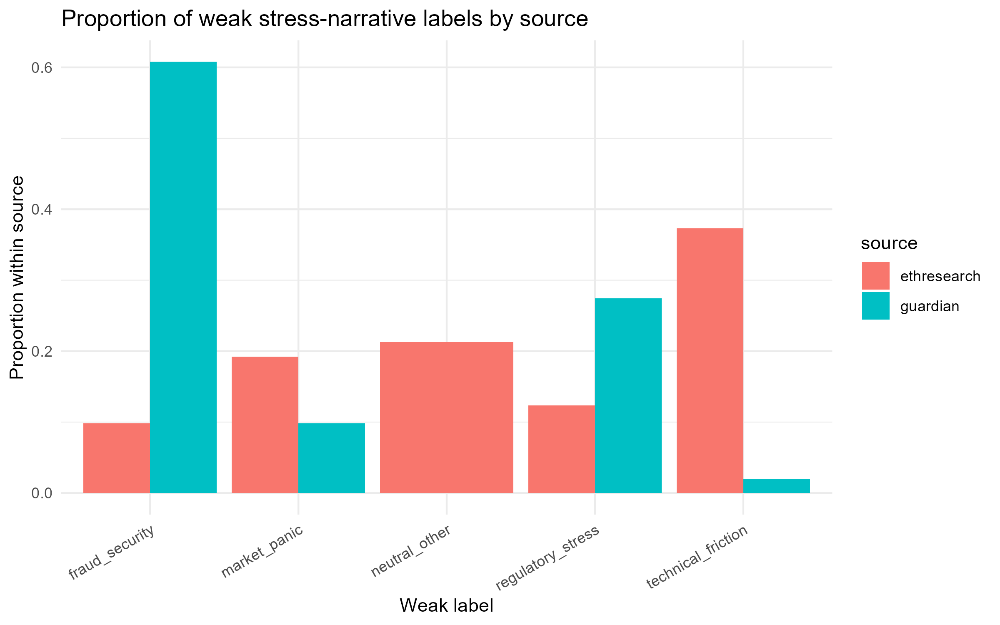

# SECU0057 Crypto Stress Narrative Project

## Project Aim

This project explores how different text sources describe stress around cryptoassets, stablecoins, regulation, fraud, and technical friction.

It compares mainstream media narratives from **The Guardian** with crypto-native technical discussions from **Ethereum Research**. The aim is not to detect money laundering directly. Instead, this project tests whether text mining and machine learning can help identify different crypto stress narratives that may later support more transparent and auditable crypto-AML analysis.

本项目使用文本数据分析不同来源如何描述加密资产、稳定币、监管、欺诈风险和技术摩擦相关的压力叙事。项目对比了 **The Guardian** 的主流媒体叙事，以及 **Ethereum Research** 的加密技术社区讨论。

本项目不直接识别洗钱行为，而是测试文本挖掘和机器学习是否能够帮助识别不同类型的 crypto stress narratives。未来这些文本压力指标可以作为更透明、可审计的 crypto-AML 分析中的 regime filter。

---

## Research Motivation

In crypto-AML analysis, on-chain signals such as gas fees or stablecoin transfer activity are difficult to interpret without market context. A gas-fee spike may reflect normal network congestion, market panic, regulatory pressure, or technical friction.

This project therefore treats text data as a way to identify the surrounding stress environment before interpreting on-chain behaviour.

---

## Data Sources

| Source | Data type | Role |
|---|---|---|
| Guardian Open Platform API | News articles | Mainstream media / public-security narrative |
| Ethereum Research JSON endpoints | Forum posts | Crypto-native technical narrative |

Reddit and Stocktwits were considered as possible retail-investor sentiment sources, but they were not used in the final dataset because of API approval, access-control, and platform-policy limitations.

---

## Methods

The project pipeline includes:

1. API / JSON-based web data collection  
2. Keyword-based relevance filtering  
3. Weak rule-based stress narrative labelling  
4. TF-IDF text mining  
5. Bigram term analysis  
6. Linear SVM classification  
7. Evaluation using accuracy, macro-F1, and confusion matrix  

The weak stress-narrative labels are:

- `fraud_security`
- `market_panic`
- `neutral_other`
- `regulatory_stress`
- `technical_friction`

---

## Key Findings

- Final combined dataset: **488 filtered texts**
  - **51** Guardian articles
  - **437** Ethereum Research posts
- Guardian texts were more concentrated in **fraud/security** and **regulatory stress** narratives.
- Ethereum Research texts were more concentrated in **technical friction**, **market panic**, and technical discussion.
- A baseline linear SVM using TF-IDF features performed above simple baseline levels on a five-class weak-label classification task.
- The results suggest that crypto stress narratives are partially distinguishable from text features, but the categories overlap and should be treated as exploratory rather than ground-truth classifications.

---

## Example Output

### Proportion of weak stress-narrative labels by source



---

## Repository Contents

```text
scripts/
  Data collection, processing, text mining, and machine learning scripts / notebooks

outputs/figures/
  Generated figures

outputs/tables/
  Generated result tables

Raw and processed data are not uploaded to this public repository. They are retained locally for reproducibility and assessment submission.


## Project Note

This repository is used as a learning and project log for the SECU0057 Applied Data Science project.

The project is also designed as a pilot text-mining module for future dissertation work on auditable crypto-AML, where text-derived stress indicators may help filter market regimes before interpreting gas-fee-based stablecoin transfer behaviour.